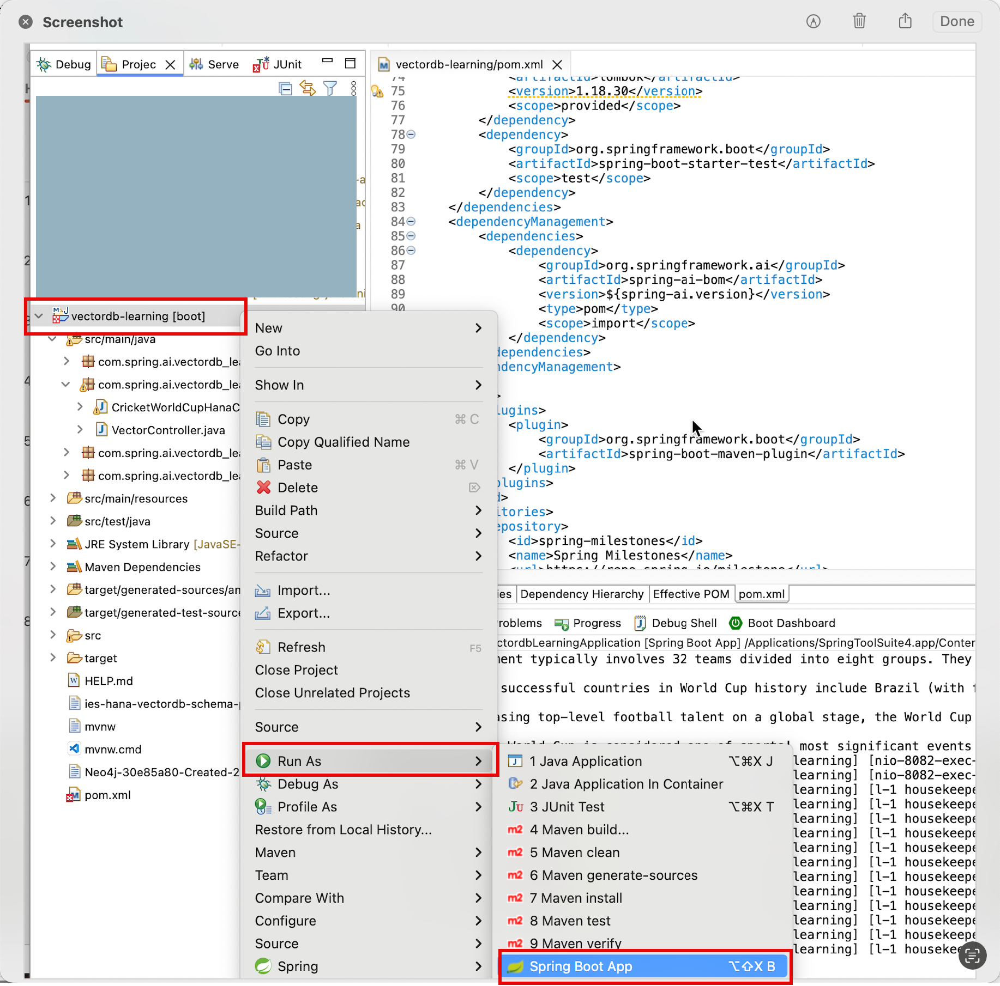
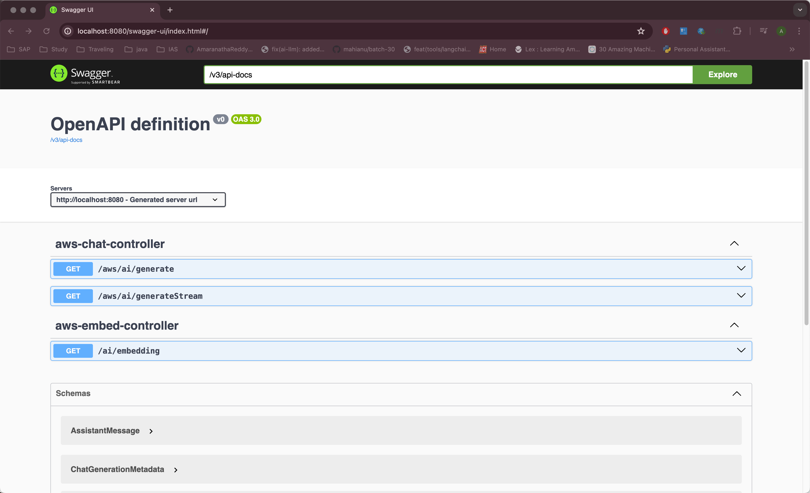

<h1 align="center">SpringAI AWS Learning</h1>
<p align="center"> 
    
</p>

<p align="center">
  <a href="#about">About</a> •
  <a href="#getting-started">Getting Started</a> •
  <a href="#aws-integration">AWS Integration</a> •
  <a href="#start-application">Start Application</a> •
  <a href="#swagger-ui">Swagger UI</a> •
  <a href="#contributors">Contributors</a>
</p>

## About
SpringAI AWS Learning Repo you will learn SpringAI Integration with AWS, Provide the RestAPI endpoints to Chat, Embeded using AWS model. 

## Getting Started

This section offers jumping off points for how to get started using Spring AI.
You should follow the steps in each of the following section according to your needs.

#### Pre-Requisites 
- [Java17](https://www.oracle.com/java/technologies/javase/jdk17-archive-downloads.html)
- [Maven](https://maven.apache.org/install.html)
- [AWS Bedrock](https://us-east-1.console.aws.amazon.com/bedrock/home)
- [Git](https://git-scm.com/downloads)
  

### Clone Git Repo

Clone the repositoy from github account
```
git clone https://github.com/GAmaranathaReddy/springai-aws-learning.git 
```

## AWS Integration

### AWS Bedrock

[Amazon Bedrock](https://docs.aws.amazon.com/bedrock/latest/userguide/what-is-bedrock.html) is a managed service that provides foundation models from various AI providers, available through a unified API.

Spring AI supports [all the Chat and Embedding AI models](https://docs.aws.amazon.com/bedrock/latest/userguide/model-ids-arns.html) available through Amazon Bedrock by implementing the Spring interfaces ChatModel, StreamingChatModel, and EmbeddingModel.

Additionally, Spring AI provides Spring Auto-Configurations and Boot Starters for all clients, making it easy to bootstrap and configure for the Bedrock models.

### Auto-configuration

Spring AI provides Spring Boot auto-configuration for the AWS Bedrock Client. To enable it add the following dependency to your project’s Maven pom.xml file:

```
<dependency>
 <artifactId>spring-ai-bedrock-ai-spring-boot-starter</artifactId>
 <groupId>org.springframework.ai</groupId>
</dependency>

```
### AWS Spring AI Properties
- Add the following properties in application.properties file
  
  ``` java
    spring.ai.bedrock.aws.region=AWS region
    spring.ai.bedrock.aws.access-key=YOUR_ACCESS_KEY
    spring.ai.bedrock.aws.secret-key=YOUR_SECRET_KEY
    spring.ai.bedrock.aws.timeout=10m
  ```

### Enable selected Bedrock model API 

By default, all models are disabled. You have to enable the chosen Bedrock models explicitly using the spring.ai.bedrock.<model>.<chat|embedding>.enabled=true property.

For example, to enable the Bedrock Llama chat model, you need to set spring.ai.bedrock.llama.chat.enabled=true.
Next, you can use the spring.ai.bedrock.<model>.<chat|embedding>.* properties to configure each model as provided.

Here are the supported <model> and <chat|embedding> combinations:

| Model           | Chat | Chat Streaming | Embedding                        |
|-----------------|------|----------------|----------------------------------|
| llama           | Yes  | Yes            | No                               |
| jurassic2       | Yes  | No             | No                               |
| cohere          | Yes  | Yes            | Yes                              |
| anthropic 2     | Yes  | Yes            | No                               |
| anthropic 3     | Yes  | Yes            | No                               |
| jurassic2 (WIP) | Yes  | No             | No                               |
| titan           | Yes  | Yes            | Yes (however, no batch support)  |


For more information, refer to the documentation below for each supported model.

- [Spring AI Bedrock Anthropic 2 Chat](https://docs.spring.io/spring-ai/reference/api/chat/bedrock/bedrock-anthropic.html): spring.ai.bedrock.anthropic.chat.enabled=true
- [Spring AI Bedrock Anthropic 3 Chat](https://docs.spring.io/spring-ai/reference/api/chat/bedrock/bedrock-anthropic3.html): spring.ai.bedrock.anthropic.chat.enabled=true
- [Spring AI Bedrock Llama Chat](https://docs.spring.io/spring-ai/reference/api/chat/bedrock/bedrock-llama.html): spring.ai.bedrock.llama.chat.enabled=true
- [Spring AI Bedrock Cohere Chat:](https://docs.spring.io/spring-ai/reference/api/chat/bedrock/bedrock-cohere.html) spring.ai.bedrock.cohere.chat.enabled=true
- [Spring AI Bedrock Cohere Embeddings](https://docs.spring.io/spring-ai/reference/api/embeddings/bedrock-cohere-embedding.html): spring.ai.bedrock.cohere.embedding.enabled=true
- [Spring AI Bedrock Titan Chat](https://docs.spring.io/spring-ai/reference/api/chat/bedrock/bedrock-titan.html): spring.ai.bedrock.titan.chat.enabled=true
- [Spring AI Bedrock Titan Embeddings](https://docs.spring.io/spring-ai/reference/api/embeddings/bedrock-titan-embedding.html): spring.ai.bedrock.titan.embedding.enabled=true
- [Spring AI Bedrock Ai21 Jurassic2 Chat](https://docs.spring.io/spring-ai/reference/api/chat/bedrock/bedrock-jurassic2.html): spring.ai.bedrock.jurassic2.chat.enabled=true


## Start Application

To run the application, run the following command in a terminal window (in the complete) directory:

### Running on command line

```
./mvnw spring-boot:run
```
### Running on IDE
Right click on project , select on run icon slick on spring boot application


## Swagger UI

Once enter url in broswer automatically display swagger page


Swagger UI Youtube Demo link : [SwaggerUI Demo](https://youtu.be/zHe94-D_0Jo)
